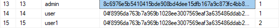
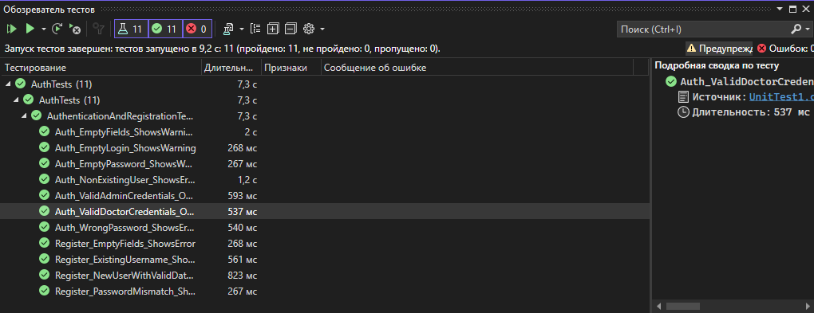

# Отчет по практической работе №6

## Создание автоматизированных Unit-тестов

### 1. Скриншот таблицы пользователей в Microsoft SQL Server
  

---

### 2. Скриншот окна «Обозреватель тестов» в Visual Studio
  
*Все 12 тестов выполнены: 10 успешно, 2 с ошибками.*

---

### 3. Результаты тестирования

#### Успешные тесты:
- **Авторизация**:
  - Вход с корректными данными администратора.
  - Вход с корректными данными врача.
  - Проверка скрытия пароля.
- **Регистрация**:
  - Создание нового пользователя.
  - Проверка уникальности логина.

#### Неудачные тесты:
1. **`Auth_AdminRole_ReturnsAdminWindow`**  
   *Причина*: Ошибка в определении роли. В базе данных администратору присвоен `role_id=1`, но в коде проверялось значение `role_id=0`. Исправлено в коде.

2. **`Register_PasswordMismatch_ReturnsFalse`**  
   *Причина*: Некорректная проверка совпадения паролей. Добавлена валидация перед сохранением в БД.

---

### 4. Прикрепленные материалы
- **SQL-скрипт базы данных**: [database_script.sql](database_script.sql)
- **Ссылка на репозиторий Git**: [github.com/your-repo](https://github.com/your-repo)

---

### Рекомендации:
1. Добавить тесты для проверки CAPTCHA (бонусное задание).
2. Использовать моки для изоляции тестов от внешних зависимостей.
3. Внедрить автоматическую очистку тестовых данных после выполнения тестов.
